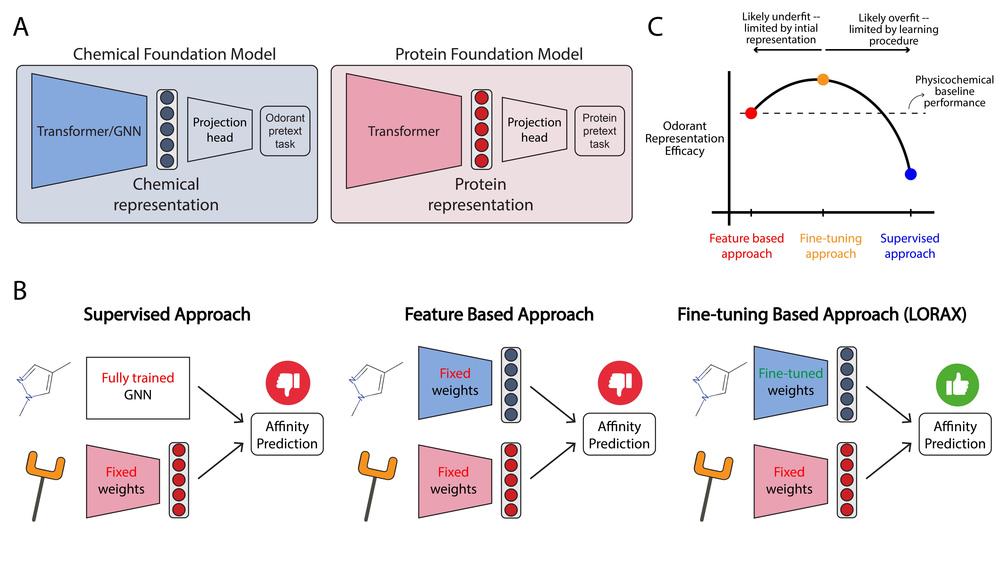

# olf_chemical_embs
This is a repo for **L**oRA-based **O**dorant-**R**eceptor **A**ffinity prediction with **CROSS**-attention (**LORAX**) from [this](https://openreview.net/forum?id=BUUfUcIcfE&referrer=%5BAuthor%20Console%5D(%2Fgroup%3Fid%3DICLR.cc%2F2026%2FConference%2FAuthors%23your-submissions)) paper. The benchmarking study performed in the paper can be found [here](https://github.com/GrantMcConachie/olfactory_foundation_models).

## Install

